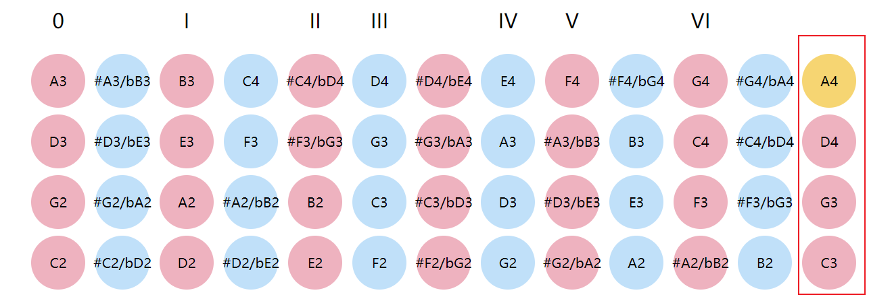
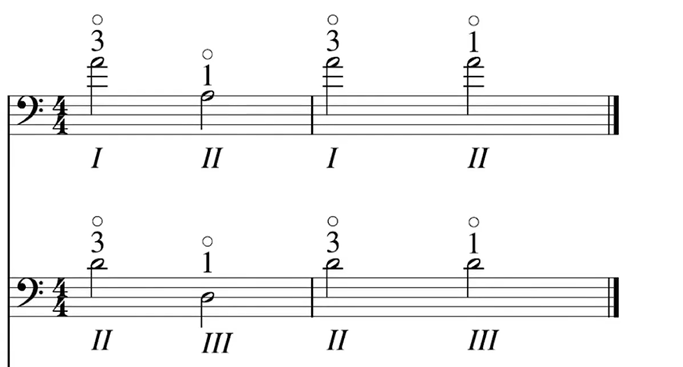
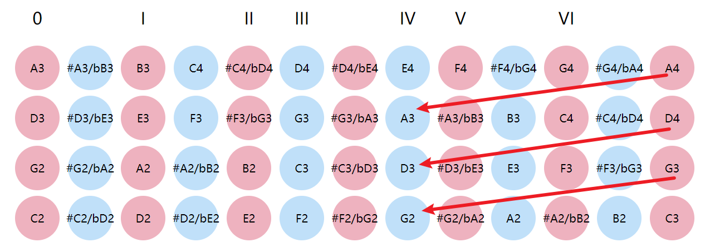

- https://en.wikipedia.org/wiki/String_harmonic

泛音的原理是这样的：手指虚按在琴弦上（仅仅接触琴弦但不用力），琴弦将受到限制，只有以此触点为节点才被保留下来。如果触点在琴弦的1/2处，那么泛音波长就是琴弦[基波](https://baike.baidu.com/item/基波/251870?fromModule=lemma_inlink)的1/2，如果触点在琴弦的1/3或2/3处，那么泛音波长就是琴弦基波的1/3，依此类推。第三、四泛音有两个触点，前面（靠近[弦枕](https://baike.baidu.com/item/弦枕/54161096?fromModule=lemma_inlink)）的触点比较容易演奏

十二平均律中几个重要的近似波长比例分别是：**纯八度（1:2）**，[小七度](https://baike.baidu.com/item/小七度/3334381?fromModule=lemma_inlink)（9:16），大六度（3:5），[小六度](https://baike.baidu.com/item/小六度/3576326?fromModule=lemma_inlink)（5:8），纯[五度](https://baike.baidu.com/item/五度/8803536?fromModule=lemma_inlink)（2:3），[纯四度](https://baike.baidu.com/item/纯四度/6469803?fromModule=lemma_inlink)（3:4），[大三度](https://baike.baidu.com/item/大三度/9925571?fromModule=lemma_inlink)（4:5），[小三度](https://baike.baidu.com/item/小三度/10502636?fromModule=lemma_inlink)（5:6），[大二度](https://baike.baidu.com/item/大二度/3269655?fromModule=lemma_inlink)（8:9），[纯一度](https://baike.baidu.com/item/纯一度/15955431?fromModule=lemma_inlink)(1:1)

将每个泛音波长通过不停乘以2的方式，使其范围在λ/2~λ之间，即与[基音](https://baike.baidu.com/item/基音/659499?fromModule=lemma_inlink)在同一个八度上，求得同八度[音名](https://baike.baidu.com/item/音名/1355359?fromModule=lemma_inlink)，再根据乘的次数求出所在八度，最终得到实际音名

| -        | 波长 | 同八度波长 | 同八度音名      | 八度差 | 实际音名 |
| -------- | ---- | ---------- | --------------- | ------ | -------- |
| 基音     | λ    | λ          | C               | 0      | c1       |
| 第一泛音 | λ/2  | λ          | C               | 1      | c2       |
| 第二泛音 | λ/3  | 2/3 λ      | G（纯五度关系） | 1      | g2       |
| 第三泛音 | λ/4  | λ          | C               | 2      | c3       |
| 第四泛音 | λ/5  | 4/5 λ      | E（大三度关系） | 2      | e3       |
| 第五泛音 | λ/6  | 2/3 λ      | G（纯五度关系） | 2      | g3       |

具体的使用场景想了想有如下

（1）演奏自然泛音，每根弦的第二泛音等于按实后本来的音，例如一弦A4，现在想想确实是1/2位置

（2）泛音调弦，按照[这个视频](https://www.bilibili.com/video/BV1wf4y1X7j7/?vd_source=a136f72026ee8b3577e31b12a3a6f648)的原理，二弦的四把位一指A3，泛音为高八度的A4，可以利用这个原理来调弦

例如下图所示的纯八度关系

