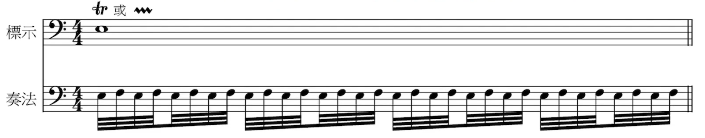

在学习铃木大提琴第三册的小步舞曲时，对如下的部分非常疑惑

通过岚音社的教学视频了解到这里涉及到颤音和后依音的奏法，岚音社yyds！

> https://www.bilibili.com/video/BV1D5411G7pU
>
> https://www.bilibili.com/video/BV1my4y127Ay

对于颤音的奏法图示如下，先奏本音再奏辅音（如果是巴洛克风格的曲子则相反）

而关于依音的奏法图示如下

